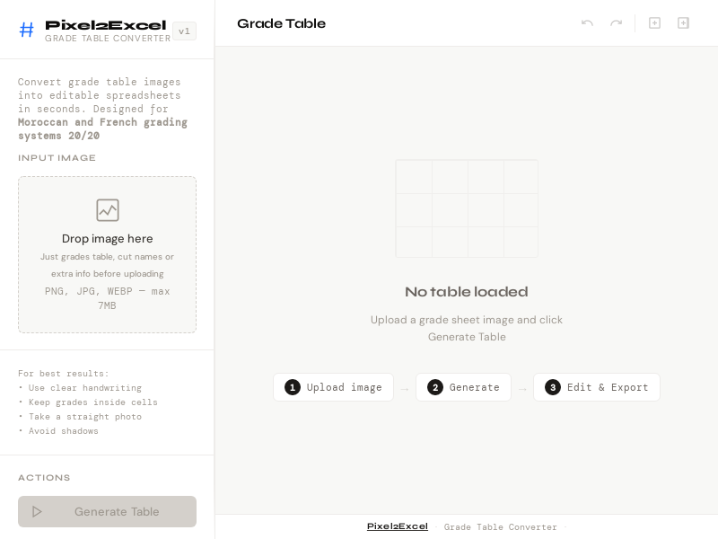

# Pixel2Excel

> Convert images of school grade tables into clean, structured data — powered by AI.

**Live:** [pixel2excel.onrender.com](https://pixel2excel.onrender.com) · *Server may take ~50s to wake up on first visit*



---

## Best practices & how to get good results

Following these tips will significantly improve extraction accuracy.

**What to upload**
- Upload images that contain **only the grade table** — nothing else
- Crop out student names, headers, stamps, signatures, or any surrounding text before uploading
- Extra information outside the table confuses the AI and reduces accuracy

**If you are filling a table by hand**
- Write **inside the cells only** — do not write outside cell boundaries or across borders
- Use **clear, separated digits** — robotic or printed-style handwriting works best
- Avoid cursive or stylized number styles (e.g. crossed 7s, looped 9s)
- Digital-style numbers (like on a calculator display) give the most reliable results

**Errors you might encounter**
- `429` or `503` errors mean the AI service is under high demand — this is not a bug
- Simply wait a few minutes and try again, the service will recover on its own
- Do not refresh repeatedly, it will not help

**Found a bug or have an idea?**
- Please open a [GitHub issue](https://github.com/your-username/pixel2excel/issues) — every report helps improve the tool for everyone
- If something went wrong or you have a suggestion, do not hesitate to reach out to the developer directly

---

## What is this?

In Moroccan and French-style education systems, teachers manage large grade tables that must be manually transferred into Excel. The process is repetitive, error-prone, and slow.

Pixel2Excel eliminates that manual work. Upload an image of any grade table — printed or handwritten — and get back clean, structured data ready for export.

---

## Live Demo

| Step | Description |
|------|-------------|
| 1 | Upload a photo or scan of a grade table |
| 2 | AI extracts the table structure and values |
| 3 | Values are cleaned and normalized to 0–20 |
| 4 | Edit cells directly, then export as CSV or XLSX |

---

## Features

- **AI-powered extraction** — Gemini API reads grade tables from any image
- **Robust JSON parsing** — handles messy, incomplete, or multi-block AI responses
- **OCR correction** — automatically fixes common misread patterns (e.g. `0.9 → 9`, `41 → 4.1`)
- **Grade normalization** — strict 0–20 validation matching Moroccan/French academic standards
- **In-browser editing** — click any cell to edit, with undo/redo support
- **Export** — download as CSV or XLSX with no external dependencies
- **Automated tests** — parser and cleaner are covered by a Node.js test suite

---

## How it works

```
Image upload
    ↓
Gemini API  ──→  raw AI response (messy text + JSON)
    ↓
safeParseJson()  ──→  extracts largest valid 2D array
    ↓
cleanGrades()  ──→  normalizes OCR errors, validates range
    ↓
Structured 2D array  ──→  rendered as editable table
    ↓
Export (CSV / XLSX)
```

### Grade normalization rules

| Pattern | Example | Result |
|---------|---------|--------|
| `0.X` | `0.9` | `9` |
| `1.X` (X ≠ 25, 5, 50, 75) | `1.3` | `13` |
| Whole number > 20 | `41` | `4.1` |
| Out of range | `999`, `-5` | `null` |

---

## Tech stack

| Layer | Technology |
|-------|-----------|
| Runtime | Node.js |
| Server | Express |
| AI | Gemini 2.5 Flash API |
| File upload | Multer |
| Frontend | Vanilla JS, CSS, HTML |
| Testing | Node.js built-in test runner |

---

## Limitations

- AI accuracy depends on image quality — blurry or low-contrast images may produce errors
- Results should always be reviewed before official use
- Designed specifically for 0–20 grading systems

---

## Version history

### v1.0.0
- Public release

### v0.1.1 — Reliability Update
- Improved JSON parsing for messy AI responses
- Added grade normalization and OCR correction
- Automated test suite
- Better API error handling

---

*Built for teachers. Made with care.*

