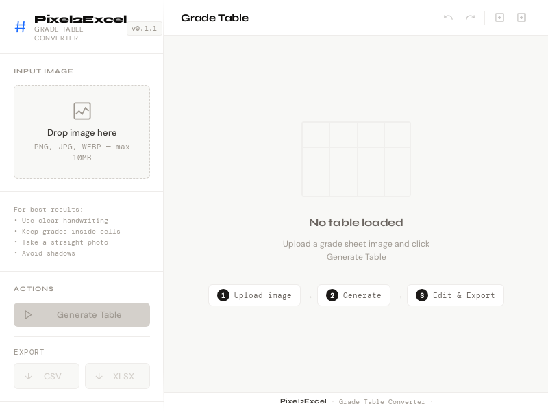

# Pixel2Excel

Convert images of school grade tables into clean, structured data using AI.

---
# Link 
[Pixel2Excel.onrender.com](https://pixel2excel.onrender.com)
###### Usually the server needs a 50s to wake up 
---

### Screenshot 

---

## Why this exists

In Moroccan and French-style education systems, teachers often manage large grade tables that must be manually transferred into Excel or similar tools.

This process is repetitive, time-consuming, and error-prone.

Pixel2Excel was built to reduce that manual work by automatically extracting grade tables from images and converting them into clean, structured data.

---

## Important Scope

This project is specifically designed for grading systems where values are between **0 and 20**.

All extracted values are automatically normalized to this range, as it matches Moroccan/French academic grading standards.

---

## What it does

- Upload an image of a grade table
- Extract structured data using AI (Gemini API)
- Clean and normalize OCR/AI errors
- Convert results into a usable 2D array
- Ensure all grades stay within 0–20 range

---

## Example

### Input
Image of a handwritten or printed grade table

### Output
```json
[
  [18, 12, 15, 17],
  [14, 10, 16, 13],
  [19, 18, 17, 15]
]
```

---

Features

AI-powered extraction from images

Robust JSON parsing (handles messy AI responses)

Grade normalization rules (OCR correction)

Strict validation (0–20 system only)

Automated tests for reliability

Error handling for API failures (429, invalid responses, etc.)


---

How it works

1. User uploads an image


2. Backend sends image to Gemini API


3. AI returns raw, messy response


4. Parser extracts the most relevant table


5. Cleaner function normalizes values


6. Final structured data is returned


---

### Tech Stack

Node.js

Express

Gemini API

Multer

Node test runner


---

### Limitations

AI may misread unclear images

Results should always be reviewed before official use

Works best with structured grade tables


---

## Future improvements

- Increase extraction accuracy (especially unclear tables)
- Improve robustness of parsing logic
- Handle API rate limits more intelligently (429 protection)
- Optimize performance under repeated requests

---

#### Version

v0.1.1 — Reliability Update

Improved parsing system

Added grade normalization rules

Added automated testing

Better API error handling


---
##### Status

Stable core pipeline. Actively improving.